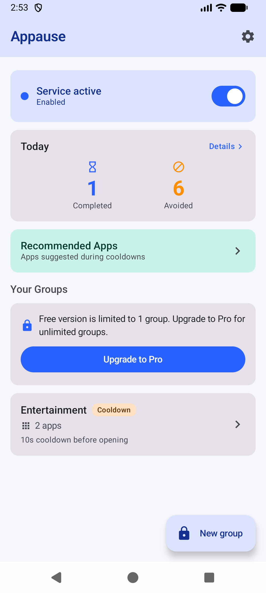
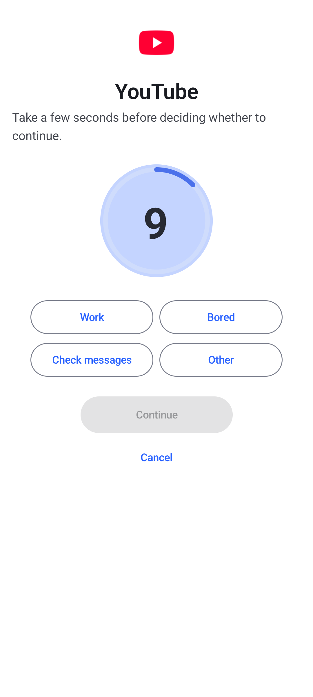
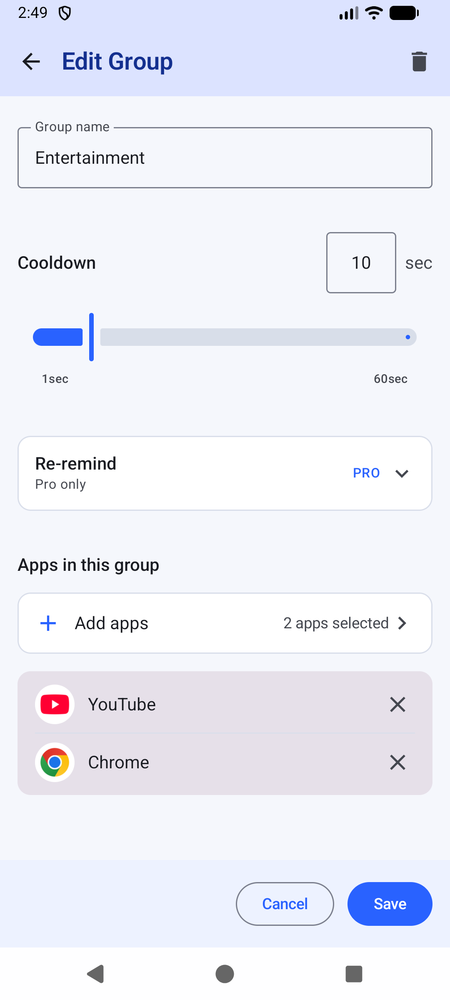
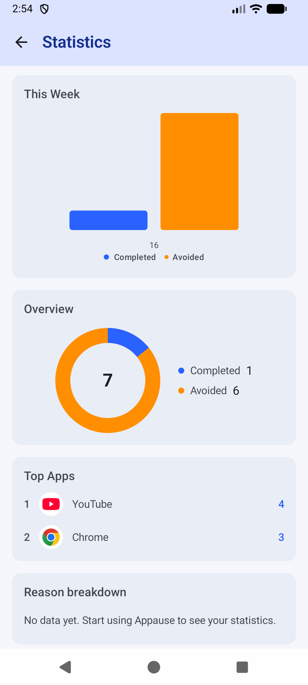
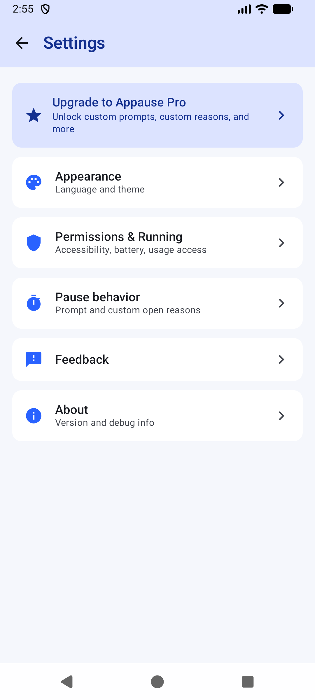
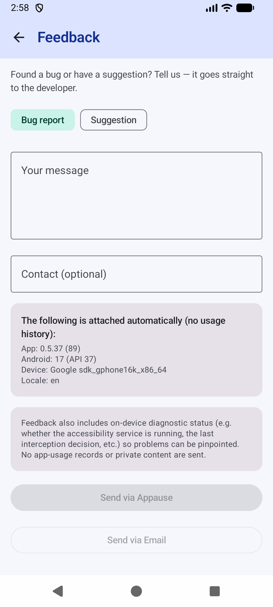

# Appause

**App + Pause**: between the impulse and the app, take a moment.

Appause is a personal Android app that helps you build mindful habits. Create
groups of distracting apps, set a cooldown for each group, and Appause shows a
brief pause screen before those apps open, so you take a moment before deciding
whether to continue.

> 🔒 **Privacy-first:** Appause is **local-first**. No account, no analytics,
> no ads, and your groups/stats never leave your device. The only network use
> is a **one-time** license check when you activate Appause Pro, and the
> feedback you choose to send. Daily use is fully offline.
> See [PRIVACY.md](PRIVACY.md).

---

## Features

- **App groups** — bundle distracting apps (e.g. Social, Entertainment) and
  manage them together. Free tier: 1 group; Pro unlocks unlimited groups.
- **Per-group cooldown** — a configurable pause (up to 60s) before a grouped
  app opens.
- **Pause screen** — a calm, dismissible countdown instead of an instant
  block. Cancel always returns you to the home screen.
- **Session timer + re-remind** — optionally get nudged again while you are
  still inside a distracting app. A session keeps counting even if you briefly
  switch apps; a real leave (home screen, or 3+ minutes away) re-arms the
  cooldown.
- **Usage stats** — see how your groups are performing over time, including a
  breakdown of why you chose to continue.
- **Dark mode** — follows the system theme.
- **Recommended apps** — suggestions to help you build your first groups.
- **OEM guidance** — built-in explanations for why detection may stop on some
  devices (battery optimization, auto-start) and how to fix it. On
  Xiaomi/HyperOS the home screen shows a persistent warning whenever battery
  optimization is not set to "unrestricted", because the system would
  otherwise kill the background service and never restart it.
- **In-app feedback** — report a bug or suggest a feature straight from
  Settings, anonymously via Appause or through email / GitHub. A structured
  diagnostic snapshot is attached automatically (service status, permissions,
  recent interception state, configured group/package details). It is shown
  before sending and is never uploaded automatically.
- **Appause Pro (optional)** — unlock unlimited groups, re-remind, a custom
  pause prompt, and custom "why are you opening this?" reasons. Activation is
  a one-time, offline-verified license (device-bound JWT): enter an activation
  code, or import a license to move to a new device. See
  [worker/README.md](worker/README.md).

---

## Screenshots

| Home | Pause screen | Groups |
|---|---|---|
|  |  |  |

| Stats | Settings | Feedback |
|---|---|---|
|  |  |  |

---

## How it works

Appause uses Android's **AccessibilityService** to detect which app is in the
foreground, by its **package name only** (`canRetrieveWindowContent = false`
— it never reads your screen). When the foreground app belongs to a group you
configured, Appause shows the pause screen for that group's cooldown.

Interception is immediate: the accessibility event itself is the foreground
signal. Genuine opens are only suppressed when the system is replaying the
recent-apps list, which fires a burst of many real apps at once and never
happens for a normal single-app open. The pause screen is drawn with the
**accessibility overlay**, which sits above every app and cannot be hidden by
apps that try to cover overlays (e.g. Xiaohongshu). The "Display over other
apps" permission is therefore optional: grant it only if the pause screen ever
fails to show.

Everything is stored **locally** (Room database + DataStore). There is no
account and no cloud sync. The only network request is a **one-time** license
redeem when you activate Appause Pro; after that, Pro works fully offline.

---

## Permissions

| Permission | Why |
|------------|-----|
| AccessibilityService | Detect the foreground app by package name (see above). **Required.** |
| Battery optimization = "unrestricted" | **Required on Xiaomi / HyperOS and similar ROMs.** Without it the system kills the background service and does not restart it, so interception silently stops. The home screen warns when this is not set. |
| Usage Access (`PACKAGE_USAGE_STATS`) | Optional but recommended. Confirms which app is genuinely on screen for the most accurate detection, so e.g. a media notification won't trigger a false pause. The query is local; no usage data leaves your device. Interception still works without it. |
| Display over other apps (`SYSTEM_ALERT_WINDOW`) | Optional fallback. Normally not needed: the pause screen uses the accessibility overlay, which other apps cannot hide and which does not require this permission. If the pause screen ever fails to show, grant it and try again. |
| Foreground Service | Keep detection alive while the device is in use. |
| POST_NOTIFICATIONS (Android 13+) | Show the "detection active" notification. |
| INTERNET | Only for the one-time Appause Pro license redeem and for feedback you choose to send. Not used during normal use. |

> ⚠️ **Set battery optimization to "unrestricted".** On Xiaomi / HyperOS and
> other OEM ROMs, the system may kill Appause's background service and won't
> restart it, so detection silently stops. Set battery to **unrestricted**,
> lock the app in recents, and allow auto-start, per [INSTALL.md](INSTALL.md).
>
> ℹ️ **"Display over other apps" is optional.** Appause draws the pause screen
> on the accessibility overlay, which other apps cannot hide and which does not
> need this permission. If you ever see no pause screen at all, grant it and
> try again.

---

## Requirements

- **Android 8.0+** (API 26)
- **Target SDK 35**
- To build: **JDK 17** and the Android SDK (see below)

---

## Build from source

### Prerequisites

- **JDK 17** (set `JAVA_HOME` to a JDK 17 install; the build fails on older
  JDKs such as Java 7/8).
- Android SDK with a platform for API 35.

### Using Android Studio

Open this folder in Android Studio, then **Run** or **Build → Build Bundle(s)
/ APK(s)**.

### Using the command line

```bash
# Debug build
./gradlew assembleDebug

# Release build (requires your own signing key — see note below)
./gradlew assembleRelease
```

> ℹ️ **Signing:** `release` builds need a signing key. Store it (and any
> passwords) in a **local, git-ignored** file (e.g. `signing.properties`) — never
> commit keys. `local.properties`, `*.keystore`, `*.jks`, and `signing.properties`
> are already excluded by [.gitignore](.gitignore).

---

## Install

- **GitHub Releases** — download the latest signed APK:
  <https://github.com/Shmily0826/Appause/releases/latest>
- **蓝奏云镜像 (China mirror)** — the mirror link is routed through a
  self-hosted aggregate counter (`/api/download?to=...&t=...`), so mirror
  installs are captured in one cross-channel total. This total is an
  *approximate floor* (no personal data stored) and is not independently
  auditable — a supplement, not the headline number.
- GitHub's Release download count is the verified headline number; the
  counter only supplements the mirror channel.
- First-run setup (allow unknown sources, dismiss OEM install warnings,
  enable accessibility, whitelist battery / auto-start): see
  [INSTALL.md](INSTALL.md).

> Appause is distributed directly as an APK. It is **not** on Google Play,
> because Google Play restricts AccessibilityService to accessibility-use cases
> for users with disabilities; Appause is a habit-forming tool for everyone.

---

## Privacy

Read the full [Privacy Policy](PRIVACY.md). In short: no account, no analytics,
no ads — your groups and stats stay on your device. The only network use is a
one-time Pro license check and the feedback you choose to send; Appause does not
collect telemetry. Optional Usage Access lets Appause confirm the foreground app
locally (no usage data leaves your device) for more accurate detection.

---

## Status

Current version: **0.5.38**. All MVP phases are complete (project setup, data
layer, interception, groups, pause UI, stats, re-remind, dark mode, OEM
guidance, usage access, in-app feedback). Appause Pro is implemented as a
device-bound, offline-verified license (Plan B): the app verifies a
server-signed JWT locally, so a fork of this open-source repo can validate but
never mint tokens.

The Pro activation chain is live: the app redeems an activation code
(`APPAUSE-XXXX-XXXX`) against the license worker, which signs a device-bound
JWT (up to 3 devices, lifetime). Code distribution is being set up on both
channels:

- **Domestic (China)**: Afdian card-code store, see
  [docs/afdian-domestic-route.md](docs/afdian-domestic-route.md).
- **Overseas**: Merchant-of-Record platforms (Lemon Squeezy / Dodo Payments /
  Paddle), see [docs/overseas-route.md](docs/overseas-route.md).

Known work:

- Real-device testing across OEM ROMs (Xiaomi HyperOS, Huawei, OPPO, vivo) to
  verify AccessibilityService survival after reboot / battery optimization.
- Overseas product fit: an English UI already exists; the remaining work is
  adapting the default group suggestions to overseas apps (Instagram, TikTok,
  YouTube) and localizing store copy.

See [PROGRESS.md](PROGRESS.md) for the full development log.

---

## Contributing

Issues and pull requests are welcome. Please read [AGENTS.md](AGENTS.md) — it
defines the project's coding conventions and the rules every contributor (and
AI agent) must follow. Keep changes focused on one task at a time, and run
`./gradlew assembleDebug` after modifying code.

---

## Feedback

Found a bug or have an idea? You can report it without leaving the app:

- **In-app:** Settings → **Feedback** — pick "Bug report" or "Suggestion",
  write your message, and send. "Send via Appause" delivers it anonymously to
  the developer (no email or account needed); you can also open an email or a
  GitHub issue instead. Your app version, Android version, device model,
  locale, and a structured diagnostic snapshot (service and permission state,
  recent foreground/interception state, configured group names and package
  names) are attached automatically and shown to you before sending. Nothing
  is uploaded unless you choose a send option.

- **Direct:** open an issue on
  [GitHub](https://github.com/Shmily0826/Appause/issues) or email
  [rng2018520@gmail.com](mailto:rng2018520@gmail.com).

Appause does not collect telemetry, so please include steps to reproduce for
bugs; the auto-attached diagnostic snapshot helps a lot.

---

## 📊 Project metrics

Curious how the project is doing? The headline numbers are **third-party
verified by GitHub** — star/fork counts, cumulative Release downloads, and
14-day traffic — collected automatically (GitHub Actions, weekly) and logged in
[METRICS.md](METRICS.md). A self-hosted aggregate counter also tracks
cross-channel installs (GitHub Releases + mirrors) as an **approximate floor**;
because it runs on our own infrastructure it is self-reported and not
independently auditable, so it is used only as a supplement — not as the
headline figure. **No user or device data is tracked** — only public, aggregate
stats, consistent with Appause's privacy-first design.

---

## Contact

- GitHub: [Shmily0826](https://github.com/Shmily0826)
- Email: rng2018520@gmail.com

---

## License

[MIT](LICENSE) © 2026 Appause authors.

---

## Disclaimer

Appause is an accessibility / habit-forming aid, not a medical, therapeutic, or
security tool. It cannot and does not guarantee behavior change.
