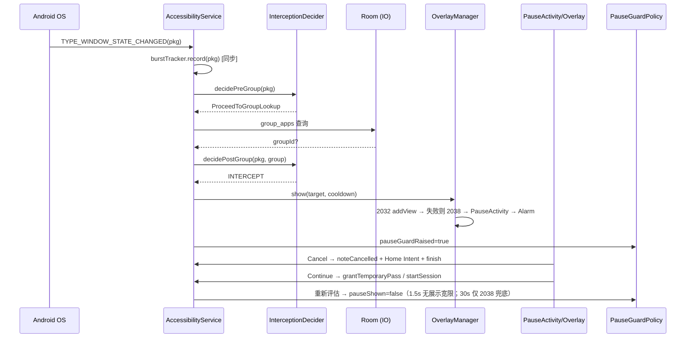

# Architecture Reconstruction — Appause

> **Scope**: 基于当前真实 implementation 反向还原的系统架构快照（read-only reconstruction，非 review）。
> **基准**: branch `main` @ `4719c28`（2026-09-17，`docs: reconcile v0.5.42 status and backlog`），versionName `0.5.42` / versionCode `94`，`com.appause.android`（debug 后缀 `.debug`）。
> **注意**: 本快照以当前 HEAD 源码与已记录的验证证据为准；工作区另有两个 pre-existing 未跟踪用户文件，未纳入实现判断。
> **更新日期**: 2026-09-17。生产 Worker 的线上 bundle 与当前 HEAD 的精确相等性未被证明。

---

## A. One-Sentence System Description

Appause 是一个**单进程 Android app**：一个 AccessibilityService 监听前台 app 变化，命中受控分组时在目标 app 上方展示倒计时 pause 屏（overlay 优先、Activity 兜底），用户选择「取消→回桌面」或「继续→临时放行」，全程本地决策、本地存储，仅在 Pro 试用/激活等明确动作时与一个 Cloudflare Worker 通信。

## B. 30-Second Architecture

单 runtime（Android app，Kotlin + Compose），无服务器依赖日常运行。事件入口是 `AppauseAccessibilityService`（`TYPE_WINDOW_STATE_CHANGED`），决策下沉到纯策略对象 `InterceptionDecider`（pre-group ~10 个 skip 分支 → 查 Room 分组 → post-group ~5 个分支 → Intercept）。展示路径 2032 accessibility overlay → 2038 → PauseActivity → AlarmManager 四级 fallback。状态分三层：Room（分组/记录，持久）、DataStore（设置/license，持久）、内存单例/服务字段（bypass/session/burst，进程死即失，**有意如此**）。Pro 的买断与试用都由 Worker 用 RS256 签设备绑定 JWT，App 内嵌公钥本地验签。

## C. Runtime Topology

| Runtime | Purpose | Entry | Lifecycle | State | 外部依赖 |
|---|---|---|---|---|---|
| Android app 主进程 | 一切 | `MainActivity`（Compose nav）/ `AppauseAccessibilityService`（事件）/ `PauseActivity`（兜底 UI）/ `PauseAlarmReceiver`（兜底启动） | service `stopWithTask=false`，系统可杀；Activity 按系统规则 | Room + DataStore 持久，内存态随进程 | PackageManager、UsageStats、AlarmManager、Android Keystore、（仅 Pro 动作）CF Worker |
| Cloudflare Worker | 试用/激活「请求→JWT」签发 + 下载门控 + 匿名反馈 | `worker/src/index.js` fetch handler | 请求驱动，无 cron | KV `APPAUSE_CODES` + DO `ACTIVATION_CODES`（SQLite，权威） | 无下游（LS/爱发电 webhook 未实现） |

无 Node server、无 VPS、无浏览器 runtime。**不要把 Worker 画成日常拦截链路的一部分**——`INTERNET` 仅用于用户明确触发的远程产品动作，例如试用、激活、解绑、反馈和下载。

## D. System Context Map

```
用户 → Android OS → [Appause app 进程]（IN PROCESS：决策/UI/存储全部本地）
                        │ PackageManager / UsageStatsManager（LOCAL EXTERNAL，OS 服务，只读）
                        │ AlarmManager（LOCAL EXTERNAL，兜底重拉）
                        │ Android Keystore（LOCAL EXTERNAL，非提取 RSA 密钥）
                        └── 仅试用/激活/解绑/反馈/下载 ──→ CF Worker（REMOTE EXTERNAL，自托管）
                                                   ├── KV / DO（Cloudflare 托管持久化）
                                                   └── 无第三方 API（爱发电=人工卡密，LS=未接入）
```

## E. Core Workflows（真实调用链）

### E1. 拦截主链路（最重要）

```
TYPE_WINDOW_STATE_CHANGED
→ AppauseAccessibilityService.onAccessibilityEvent (:762-865)
  仅此一种事件；同步 burstTracker.record()（保序，a11y 线程）
→ serviceScope.launch（Main dispatcher）→ handleForegroundChangeImpl (:1057-1270)
→ InterceptionDecider.decidePreGroup (:236-308)：
   ①禁用→②自身包→③stale cancelled(800ms)→④temporary pass→⑤session 活跃→
   ⑥去重(lastFg==pkg)→⑦Home 转场 abandon cooldown→⑧系统包→⑨bypass→⑩pauseShown→
   ⑪二次去重 → 否则 ProceedToGroupLookup
→ withContext(IO) 查 Room：packageName ∈ group_apps？
→ decidePostGroup (:311-333)：不在组 skip → burst 抑制(≥3 包/120ms→SkipBurstReplay) →
   状态变更 skip → 命中 → **Intercept**
→ OverlayManager.show (:150-629)：
   2032 TYPE_ACCESSIBILITY_OVERLAY（service 原始 context 的 token，主路径）
   → BadTokenException 且非小米/Android16 → 2038
   → 仍失败 → startActivity(PauseActivity, singleInstance) + AlarmManager(+250ms setExactAndAllowWhileIdle)
   → AlarmManager 失败 → 主线程 Handler +250ms 再拉
→ 用户分支：
   Cancel → noteCancelled(抑制 800ms) → Home Intent → finish（Overlay 路径 dismiss 等价）
   Continue/倒计时完 → grantTemporaryPass / startSessionAfterProceed → onSessionStart
     （Pro 且 reRemindMinutes>0 → ReRemindSchedulePolicy → scheduleReRemind）
→ guard 看门狗：pauseShown = raised && (overlayAttached || pauseActivityVisible)；
   无展示时宽限 1500ms；硬上限 30000ms 只释放可被目标隐藏的 2038 fallback（PauseGuardPolicy :60-71）
```

### E2. Pro 买断与试用

买断链路是 `ProScreen 输入码 → ProViewModel.redeemCode → ProState.redeemCode`（设备指纹 = Keystore RSA 公钥 DER 的 SHA-256 hex）`→ HttpURLConnection POST {code,device} → /api/redeem`（15s 超时）`→ Worker DO 校验码池/设备上限 → RS256 签 JWT{tier,jti,device}`（买断码无 `exp`）`→ 本地 LicenseVerifier.verify → SettingsDataStore.setLicenseToken`。用户不再有 JWT 导入/导出路径；`verifyAndPersistLicenseToken` 只供 redeem/trial 响应内部使用。

试用链路是 `Home（仅 entitlement=FREE 显示 CTA）→ ProScreen`；Home CTA 只导航，不重复实现试用逻辑。ProScreen 的 `Start 7-day trial → ProViewModel.startTrial → ProState.startTrial` 发送 `POST {device} → /api/trial/start`。Worker 将 fingerprint 哈希为确定性的 `TRIAL-...` Durable Object 名称；首次成功创建 `kind=trial`、单设备、`expiresInDays=7` 的记录并签发 `{tier:"pro", trial:true, iat, exp, device}`；响应包含 `newlyStarted=true`、`activatedAt`、`expiresAt`。重复请求保持首次 `expiresAt`，返回 `alreadyStarted=true` 并重新签发 token。Android 在持久化前本地验证签名、`tier`、`trial`、设备绑定、有效期以及 response 的七天窗口；已有有效 entitlement 不会被试用动作降级。错误映射包括 `trial_expired / trial_state_invalid / trial_unavailable / token_verify_failed`。

### E3. 配置编辑（UI→数据）

`Screen → ViewModel → AppGroupRepository`（AppauseApp 单例）`→ AppGroupDao / AppLaunchDao + SettingsDataStore`。ViewModel 不碰 DAO。数据变化经 Room Flow 反向推给 UI。

### E4. 反馈

Settings→Feedback 组装**本地诊断快照**，`POST /api/feedback` 存 KV `feedback:*`（匿名，Worker 侧无 PII 设计）。

## F. State Ownership Map

| State | Owner | Readers | Writers | Persistence | Lifetime / 真相源 |
|---|---|---|---|---|---|
| 分组+受控 app | Room `app_groups` / `group_apps` | Repository→UI | Repository（用户操作） | Room v6，`appause.db` | 持久；SOT=Room |
| 拦截记录 | Room `app_launch_records` | StatsScreen（SQL 聚合） | `logLaunch` | Room | 365 天保留，启动时清旧 |
| 设置/开关/临时通行证 | DataStore `settings` | 各 ViewModel | Repository / ProState | DataStore | 持久；主题镜像到 SharedPreferences（冷启动同步用） |
| License token | DataStore `LICENSE_TOKEN_KEY` | `ProState.isPro`（combine(debug 标志, 本地验签)） | redeem/trial 成功后 | DataStore | 持久；SOT=token 本身+本地验签 |
| `isPro` 运行时判定 | `ProState`（App 单例） | UI / ReRemindPolicy | — | 派生 Flow | 派生态，无独立 SOT |
| bypass 列表 | `InterceptionManager.bypassedPackages`（object 单例，ConcurrentHashMap） | Decider / Service | PauseActivity proceed | **无** | 进程死即清（AGENTS.md 认可） |
| session（started/foreground） | `SessionState`（service 字段） | Decider | Service | 无 | 随 service |
| `lastForegroundPackage` / `justCancelledPackage` | service companion @Volatile | Decider | Service | 无 | 随进程 |
| burst 指纹 | `BurstTracker`（service 字段） | Decider | `record()`（a11y 线程同步） | 无 | 120ms 窗口内 |
| pauseShown | service 属性（看门狗策略派生） | Decider / guard | Policy evaluate | 无 | 派生自 overlayAttached\|\|pauseActivityVisible |
| 码/设备绑定（服务端） | DO `ACTIVATION_CODES`（每码一实例，KV 惰性 bootstrap） | Worker | Worker redeem / unbind | Cloudflare | SOT=DO；KV 仅种子 |

**多副本记录（不评判）**：语言/主题同时存在于 DataStore 与 SharedPreferences；`PACKAGE_USAGE_STATS` 注释描述的「前台确认」与 v0.5.24 实际策略（信任无障碍事件、poller 不反确认）在 manifest 注释与代码间存在张力——当前实现以事件为准（CONFIRMED）。

## G. Data Flow Map

```
a11y 事件包名（原始 string）
  → BurstTracker.record（时序指纹）          [语义变化点1：事件→"是否疑似重放"]
  → Decider 15+ 分支过滤                     [语义变化点2：包名→"决策"]
  → Room group_apps 查询                     [语义变化点3：决策→"是否受控"]
  → logLaunch(AppLaunchRecord)               [语义变化点4：行为→统计事实]
  → DAO SQL 聚合 → StatsModels POJO → UI     [语义变化点5：事实→视图数据]
激活码: 用户输入 + Keystore 公钥指纹 → JSON POST → Worker DO 状态机 → JWT → 本地验签 → DataStore
```

## H. Persistence Map

| 存储 | What | Writes | Lifetime | Migration | 失败行为 |
|---|---|---|---|---|---|
| Room `appause.db` v6 | 3 表（groups/apps/records） | Repository | **persistent** | 5 段手写 MIGRATION_1_2…5_6，exportSchema=true | DB 失败→拦截链查询失败即不拦（fail-open） |
| DataStore `settings` | 设置/license/onboarding 标记 | Repository / ProState | **persistent** | 无版本化 schema（key-value） | 读失败→默认值 |
| SharedPreferences | 主题/语言镜像 | 冷启动同步 | persistent | — | 仅镜像 |
| KV `APPAUSE_CODES` | 码种子/反馈/下载计数 | Worker | persistent | — | DO 从 KV bootstrap |
| DO `ACTIVATION_CODES`（SQLite） | 每码绑定状态 | Worker | persistent | — | 见 K |
| 内存态（bypass/session/burst/lastFg） | runtime | Service / PauseActivity | **ephemeral** | 无 | 进程死→下次重新冷却（设计意图） |
| `allowBackup=false` | — | — | — | — | 备份排除全部本地数据（manifest 注释明示） |

## I. Async / Background Model

| 边界 | Trigger | 执行者 | 完成/取消/重试 | 可见性 |
|---|---|---|---|---|
| 事件处理 | onAccessibilityEvent | `serviceScope`（SupervisorJob+Main） | 无取消；无重试 | 决策 skip/intercept 记入诊断日志 |
| burst 记录 | 事件同步调用 | a11y 线程直调 | — | — |
| Room 查询 | 决策内 | `withContext(IO)` | 失败即放行 | — |
| re-remind 定时 | onSessionStart（Pro） | Handler / scheduleReRemind | 离开目标 app 即 pause（不 reset） | pause 屏二次弹出 |
| AlarmManager 兜底 | PauseActivity 启动失败 | 系统 alarm，+250ms | 失败降级 Handler | — |
| 前台 poller | service 内协程周期跑 | serviceScope | 去重后不污染决策 | — |
| 365 天清理 | App.onCreate | 协程 | 无重试 | — |
| Worker | HTTP 请求驱动 | Cloudflare | 无 cron、无重试 | 错误码见 K |

## J. External Dependency Map

| Service | Purpose | 协议/认证 | 方向 | 失败模式 | Data exchanged |
|---|---|---|---|---|---|
| CF Worker `appause-pro-worker` | 签发试用/激活设备绑定 JWT / 反馈 / 下载门控 | HTTPS；`x-admin-key` / `DOWNLOAD_TOKEN`；激活码或设备 fingerprint 是凭据 | 出站+入站 | 403/404/403/500（见 K）；App 侧 15s 超时→network_error | `{code,device}` 或 `{device}` ⇄ `{token}`；匿名反馈 |
| Android Keystore | RSA-2048 非提取密钥（alias `appause_device_key`） | OS API | — | 指纹算不出→无法激活 | — |
| PackageManager / UsageStats | 列 app / 前台佐证 | OS API，需用户授予 Usage access | 只读 | 不可用→决策退化为纯事件 | — |
| AlarmManager | 兜底拉起 PauseActivity | OS API | — | 缺 exact alarm→Handler 降级 | — |
| Lemon Squeezy / 爱发电 | **未接入代码**（LS 无 API 调用，爱发电=人工卡密，`gencodes-batch.mjs` 只产文本） | — | — | — | — |

### Worker API 面（参考）

- `POST /api/trial/start`（设备 fingerprint→一次性七天 JWT，DO 按 fingerprint 固定身份）、`POST /api/redeem`（码→JWT，DO 校验）、`POST /api/unbind`（自助解绑）、`POST /api/feedback`（匿名反馈存 KV）
- `POST /admin/gencode`、`POST /admin/unbind`、`GET /admin/feedback`（`x-admin-key` 比对）
- `GET /api/download`（`DOWNLOAD_TOKEN` 门控 + 计数 + 302）、`GET /api/download-count`（公开读）
- 码格式 `APPAUSE-XXXX-XXXX`；试用 JWT payload `{tier:"pro", trial:true, iat, jti:TRIAL-..., exp, device}`，买断 JWT 无 `exp`
- 爱发电仅手动卡密发放，无 webhook；Lemon Squeezy 未接入（`/api/redeem-ls` 仅规划）

## K. Failure & Recovery Model

| Failure | 传播 | 用户可见 | 恢复 |
|---|---|---|---|
| 2032 BadTokenException | try/catch→2038→PauseActivity→Alarm→Handler | 无感（四级降级） | 自动 |
| 服务被杀（HyperOS） | 进程死，内存态清零 | 拦截失效；首页红色警告（电池无限制引导） | 用户手动恢复服务；状态**不重建**（设计意图：重新冷却） |
| overlay 被藏/卡死 | 2038 fallback 超过 30s 才强制 RELEASE；非 hideable 2032 或可见 PauseActivity 保持 guard | pause 屏消失，guard 复位 | 自动 |
| Room 查询失败 | 决策中断 | 该次不拦（fail-open） | 下次事件重试 |
| 激活码无效/超限 | Worker 404/403 → App error 映射 | ProScreen 错误提示 | 用户换码/解绑 |
| 网络超时 | 15s→`network_error` | ProScreen 提示 | 用户重试；**无自动重试** |
| 签名失败（服务端） | 500 `signing_failed` | 错误提示 | 服务端修复 |
| 同设备重复兑换 | DO 幂等：重签 token 返回成功 | 无感 | — |
| 试用状态重复启动 | DO 按 fingerprint 幂等，保持首次 expiry 并重签 token | 首次成功或已开始 | 过期返回 `trial_expired`；畸形状态 fail-closed |

核心 workflows 的显式 recovery：**仅靠用户重试与系统自动降级；无队列、无后台重发、无状态回放**。多处适用 `NO EXPLICIT RECOVERY`。

## L. Important Invariants（最重要的 10 条）

1. **一个包名只能属于一个分组**——`group_apps.packageName` 主键强制。Enforced: Room schema。
2. **Appause 自身 / launcher / system 包永不拦截**——Decider 前置分支。防自锁。
3. **Cancel 必须回 Home 而非 finish 露出目标 app**——`handleCancel` → Home Intent。
4. **bypass 是临时的**：离开目标 app（确认 Home 转场 / 3 分钟 away）后 re-arm。
5. **pauseShown 判据 = overlayAttached \|\| pauseActivityVisible**；无展示时有 1.5s 宽限，30s 硬上限只适用于可被目标隐藏的 2038 fallback——防 guard 永久卡死而不牺牲 2032 长倒计时。
6. **2032 必须用 service 原始 context 的 WindowManager**——wrap 过的 context 丢 token → BadTokenException。
7. **license token 设备绑定**：JWT `device` 声明 = Keystore 公钥指纹；本地验签比对；换机不能迁移 token，买断码需在新设备重新激活，试用不跨设备迁移。
8. **一码最多绑定设备数上限**（DO 内 enforce，超限 403）；同设备重复兑换幂等重签；试用 DO 固定单设备与七天窗口。
9. **拦截决策不依赖网络**；网络只在 Pro 试用/激活/反馈/下载路径。
10. **无遥测**：`allowBackup=false`、零 analytics SDK、`canRetrieveWindowContent=false`（只拿包名）。

## M. Domain Vocabulary

| Term | Meaning | Owner | 别混淆 |
|---|---|---|---|
| **Group / cooldown** | 一组受控 app 共享的倒计时秒数 | Room `app_groups` | 与 Free 60s 上限区分（`FREE_COOLDOWN_MAX_SECONDS`） |
| **Session** | 从进入目标 app 到确认离开的持续期 | `SessionState` + Decider | ≠ bypass（bypass=本次放行许可） |
| **Bypass / TemporaryPass** | 继续→放行；后者带 5/15/30 分钟持久化有效期 | InterceptionManager / DataStore | bypass 是进程内存态，TemporaryPass 可跨进程 |
| **2032 / 2038** | `TYPE_ACCESSIBILITY_OVERLAY`（主）/ `TYPE_APPLICATION_OVERLAY`（兜底）窗口类型 | OverlayManager | 2038 会被 `setHideOverlayWindows` 藏掉（小红书） |
| **Burst replay** | 最近任务重放风暴（120ms 内 ≥3 真实包）抑制 | BurstTracker | ≠ 单包去重（Decider pre-⑥） |
| **Re-remind** | 会话内按间隔二次提醒（Pro 功能） | ReRemindSchedulePolicy | ≠ 重新冷却 |
| **Device fingerprint** | Keystore RSA 公钥 DER 的 SHA-256 hex | DeviceKeyStore | ≠ 设备 ID / IMEI |
| **Activation code** | `APPAUSE-XXXX-XXXX`，DO 实例即其权威状态 | Worker | ≠ JWT（码换 token） |
| **Trial** | 由 fingerprint 派生 DO 身份的一次性、单设备、七天 Pro entitlement | Worker DO + ProState | ≠ 买断码；重复请求不重置首次 expiry |

## N. Architecture Diagrams

**Core Sequence（拦截 → 用户决策 → 释放）**：



系统上下文图见 §D（文字版）；状态机 / Data Flow 图判断为不必要——拦截链本质是「过滤管线」而非持久状态机，内存态全部 ephemeral。

## O. Validation and Evidence（截至 2026-09-17）

| 验证层级 | 已有证据 | 能证明什么 / 不能证明什么 |
|---|---|---|
| Source / current HEAD | `main` @ `4719c28`；`HomeScreen` 只在 `entitlement=FREE` 显示 CTA，点击只导航到 Pro；`ProState` 负责试用 POST、JWT 验证与持久化 | 当前源码的架构与行为；不等于线上 bundle |
| Local deterministic | Worker suite 31 checks + RS256 interop；v0.5.42 记录的 focused Android tests 与 `assembleDebug` PASS | 本地 handler、DO、验签和 Android 逻辑；不等于真实 Cloudflare 资源或线上请求 |
| Emulator | API 37 `Medium_Phone` 的 2032 overlay、看门狗与人类化 stress evidence PASS | Android 模拟器行为；不等于物理设备 |
| Physical device | Xiaomi 2410DPN6CC / HyperOS / Android 16 的统计页、Home/Recents 及单服务 Temporary Pass 锁屏过期验证有 objective ADB/logcat/WindowManager evidence | 物理设备特定路径；没有试用客户端 UI 的物理设备端到端证据，也没有 Xiaomi exact-30s watchdog 证据 |
| Production | Worker `appause-pro-worker` 的当前 100% deployment metadata 指向 version `4af734fe-1bd8-41da-93c9-9c03d5c2f4ed`（2026-09-11）。2026-09-17 对 `https://appause-pro-worker.rng2018520.workers.dev/api/trial/start` 使用 synthetic fingerprint `b18b6c63e6a7a5301d7ccd3258751ab969a41d68ccb2b9dc6482d4b14b5546c4`：首次 POST HTTP 200 并返回 token；同 fingerprint 重试 HTTP 200、`alreadyStarted=true`、`newlyStarted=false`。响应 `activatedAt=1789644428946`、`expiresAt=1790249228946`，窗口 `604800000 ms`；JWT `tier=pro`、`trial=true`、`device` 匹配、RS256 签名用仓库 production PEM 验证通过，`exp` 与 response expiry 对齐。 | 线上 endpoint、DO 创建与 Worker 幂等行为；不能证明线上 bundle 与当前 HEAD 精确相等。重复请求 token 的 `iat=1789644459` 是重签时刻，而 response 的 `activatedAt` 保持首次时刻（`floor=1789644428`）；当前 Android 严格要求两者相等，因此重复响应会被客户端判为 `token_verify_failed`，这是尚未修复的跨层 gap |

生产 smoke 只创建了这一条 synthetic trial record；未使用真实设备 fingerprint，未发送第三次请求，未部署或修改生产配置。

## P. Unknown / Ambiguous Areas

- **SOURCE_OF_TRUTH_AMBIGUOUS（轻微）**：UsageStats 在现行决策中的确切权重——manifest 注释与 v0.5.24 实现口径不一；判定为「poller 佐证、事件为准」，但 `ForegroundChecker` 对受控 app 是否完全旁路未逐行确认（LIKELY）。
- `Converters.kt` 为占位（CONFIRMED 空置）。
- Worker `handleUnbind` 的具体限额/频率限制未深入（UNKNOWN）。
- 当前工作区只有两个 pre-existing 未跟踪用户文件；本次未分析或修改其内容。
- Re-remind 的 wall-clock / 切换暂停语义由 ARCHITECTURE.md §6.4 + 代码交叉确认，但进程死亡中断会话等边界场景未验证（LIKELY）。
- 生产 Worker 的 exact bundle/source 与当前 HEAD 的相等性未证明；线上重复试用 token 的 `iat` 与首次 `activatedAt` 不一致，需单独决定源码修复与后续部署。

## Q. Documentation Drift（截至 2026-09-17）

| 文档 | 状态 |
|---|---|
| `README.md` | **ACCURATE**：当前公开版本为 v0.5.42 / versionCode 94，并描述了当前试用入口与本地验签语义 |
| `INSTALL.md` | **ACCURATE**：当前公开 APK 为 `Appause-v0.5.42.apk`，权限与覆盖安装说明与当前产品一致 |
| `worker/README.md` | **ACCURATE**：试用 endpoint 与 v0.5.42 production verification-key 说明已同步；部署仍是独立操作 |
| `ARCHITECTURE.md` | **PARTIALLY STALE**：① §8 "Phase 0 ← Current" 明显过期；② §4 entity 表缺大量列（re-remind 系列、reason 等）；③ §4.4 DataStore 只列 2 个 key，实际 15+；④ §6.2 bypass 模型已被 §6.4 session 模型取代（§6.4 本身 ACCURATE）；⑤ 目录结构缺 `interception/`（BurstTracker、InterceptionDecider）、`diagnostics/` 等；⑥ `PauseAlarmReceiver` 在目录树中注释为 "schedule re-remind"，实际主要是兜底拉 PauseActivity |
| `AGENTS.md` | **ACCURATE**（2032/2038 优先级、debug 诊断页约束与代码一致） |
| `docs/overseas-route.md` | **规划态**（LS 未接入代码，文档已标注） |

## R. 30-Minute Reading Path

1. `README.md`（3 min）— 产品是什么
2. `AGENTS.md` §8/§9（4 min）— 2032/2038/Activity 优先级与红线，比 ARCHITECTURE.md 更接近现状
3. `AndroidManifest.xml`（3 min）— 全部系统入口与权限意图，注释质量高
4. `service/AppauseAccessibilityService.kt` 的 `onAccessibilityEvent` + `handleForegroundChangeImpl`（8 min）— 主链路
5. `interception/InterceptionDecider.kt`（4 min）— 决策全部分支，纯函数可整读
6. `service/OverlayManager.kt` 的 `show()`（4 min）— 四级 fallback
7. `data/local/AppDatabase.kt` + `data/repository/AppGroupRepository.kt`（3 min）— 数据层
8. `data/pro/ProState.kt`（3 min）— Pro 链路收口
9. `worker/src/index.js` 的路由 switch（3 min）— 唯一后端的全貌

## S. 2-Minute Explanation（可直接用于 interview）

> Appause is a local-first Android focus tool, single process, Kotlin + Jetpack Compose. The core loop: an AccessibilityService — with window-content retrieval disabled, we only read foreground package names — receives foreground events and feeds them into a pure decision object with explicit skip rules. If the package belongs to a configured local Room group, Appause shows a countdown using a 2032 accessibility overlay first, then compatibility fallbacks. A guard keeps attached non-hideable 2032 overlays and visible PauseActivity instances alive; the 30-second cap is for the hideable 2038 fallback or stale no-presentation state. Room stores groups and interception logs, DataStore stores settings and the verified license token, and bypass/session state is intentionally ephemeral. Explicit trial, activation, feedback, and download actions reach the self-hosted Cloudflare Worker; the app verifies Pro JWT signatures locally against an embedded public key, so an accepted entitlement works offline and there is no automatic license polling or analytics telemetry.
