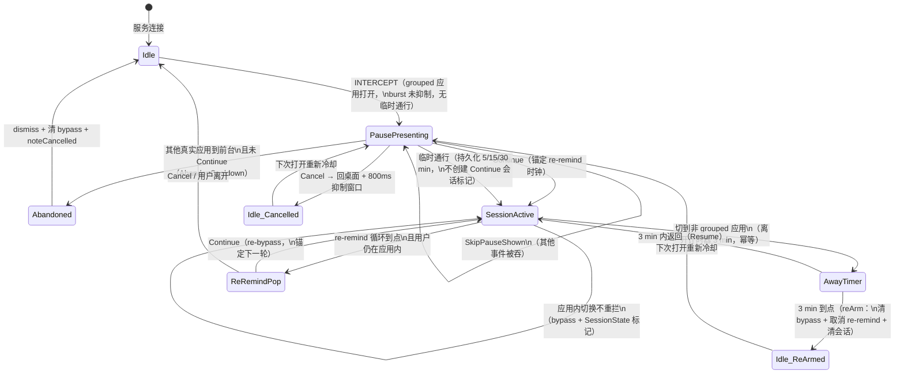

# Appause 拦截协议（Interception Protocol）

> 状态：只读架构审计的产出，记录截至 `main` @ `461ee33`（2026-09-06）的真实行为。
> 本文档不描述"应该怎样"，只描述"代码现在实际怎样"。改代码后应同步更新本文。

## 0. 为什么要有一份协议

Appause 的拦截行为不是一次性设计出来的，而是 v0.5.1 → v0.5.39 期间几十次
真机排错"长"出来的（HyperOS 事件重放、2032/2038 窗口差异、看门狗、Home 确认……）。
这些知识原本散落在代码注释、AGENTS.md 注意事项和 PROGRESS.md 的调试记录里。
本文把它们整理成一份人能读的协议，作为以后排查和重构的地图。

## 1. 组件地图

| 组件 | 文件 | 角色 |
|---|---|---|
| 事件入口 | `service/AppauseAccessibilityService.kt` | 接收事件、启动确认/poller、执行副作用 |
| 纯决策层 | `interception/InterceptionDecider.kt` | 过滤链（步骤 1–6.6），无副作用 |
| 爆发指纹 | `interception/BurstTracker.kt` | 识别 HyperOS Recents 重放 |
| 通行状态 | `interception/InterceptionManager.kt` | 运行时 bypass 集合（单例） |
| 会话标记 | `service/SessionState.kt` | 防止 re-remind 循环重复启动 |
| 覆盖层 | `service/OverlayManager.kt` | 2032 → 2038 → Activity 降级链、倒计时 UI |
| 展示策略 | `service/OverlayPresentationPolicy.kt` | 窗口类型/flag 的纯策略 |
| Home 确认 | `service/AppauseAccessibilityService.kt` 内 `HomeTransitionPolicy` | Home/Recents 事件的可信度判定 |
| 前景确认 | `service/ForegroundChecker.kt` | UsageStats 事件日志解析（需使用情况访问权限） |
| 临时通行 | `data/settings/TemporaryPass.kt` + `SettingsDataStore` | 持久化的包级豁免（5/15/30 分钟） |
| re-remind | service 内循环 + `service/ReRemindSchedulePolicy.kt` | 会话内周期性再弹（Pro 门控） |
| 健康状态 | `service/AccessibilityHealth.kt` | 无障碍服务健康判定（系统证据 + 进程证据） |
| Pause 界面 | `ui/pause/PauseActivity.kt` + `ui/pause/PauseScreenContent` | Activity 降级路径与 overlay 共用 UI |

## 2. 两个输入源

拦截逻辑有**两个并行输入**，最终汇入同一个 `handleForegroundChange()`：

1. **事件流**：`onAccessibilityEvent`，只处理 `TYPE_WINDOW_STATE_CHANGED`。
   可信度高（v0.5.24 起"信任事件"），但 HyperOS 会重放/延迟。
2. **前台轮询**：每 1.5 s 一次 `ForegroundChecker.getForegroundPackage()`（需要
   使用情况访问权限；未授权则整个 poller 是 no-op）。补事件流的两个洞：
   从图标冷启动时事件早于 UsageStats、部分 ROM 丢事件。
   **关键限制**：poller 对 grouped 目标应用只更新 `lastPolledPackage` 后直接
   `continue`，绝不把它当作前景写回状态（HyperOS 会把后台目标误报为前景，
   v0.5.25 教训）。它只负责在 launcher/系统/其他应用真正在前台时推进状态。

事件流先做"导航确认"预处理（见 §4），然后统一进入决策管线。

## 3. 决策管线（handleForegroundChange）

```
事件/轮询 → handleForegroundChange(pkg)
  ├─ 记录 prevForeground，更新 lastEventForeground（每次调用都更新）
  ├─ decidePreGroup(snapshot)          ← 纯函数，pauseShown 以 lambda 惰性读取
  │    1.  !isEnabled                    → SkipDisabled
  │    2.  自己的包名                     → SkipSelf
  │    2.5  justCancelled 且 lastFg 相同 → SkipStaleCancelled
  │    2.55 临时通行有效（持久化）        → SkipTemporaryPass
  │    2.57  Continue 会话标记仍活跃      → Resume
  │    2.6  三重去重（lastFg==pkg && 无 pause && prevEvent==pkg）
  │                                      → SkipDedup（不写 lastDecision）
  │    2.7  Home 且前景确认 且 pause 显示 → AbandonCooldown
  │    3.  系统包（launcher 集合 + 固定系统清单）→ SkipSystem
  │        └─ 副作用：给"刚离开的 bypass 应用"启动 3 分钟离开计时器
  │    4.  isBypassed                    → Resume（离开窗口内返回）
  │    4.5  pause 显示                    → AbandonCooldown 或 SkipPauseShown
  │    5.  双重去重                       → SkipDuplicate
  │    → ProceedToGroupLookup
  ├─ Room 查询 findGroupForPackage(pkg)  ← 唯一挂起点，状态可能在此窗口内变化
  ├─ burstTracker 判定（≥3 个不同真实应用/120ms → 抑制 1.5s）
  ├─ decidePostGroup(snapshot)          ← 重新读取 pauseShown/bypass/临时通行
  │    6.  无分组                         → SkipNoGroup
  │    6.55 临时通行（查询期间新出现）    → SkipTemporaryPass
  │    6.5  burst 抑制                    → SkipBurstReplay
  │    6.6  pause/bypass 状态在查询期间变化 → SkipStateChanged
  │    7.  → Intercept
  └─ Intercept → OverlayManager.show(...)（见 §6）
```

要点：
- **两段式决策**是刻意保留的：Room 查询会挂起，查询前后的 guard/bypass 状态都要重读。
- **`pauseShown` 的 getter 有副作用**（看门狗，见 §5），所以作为 `() -> Boolean`
  传入决策层，在和历史内联代码完全相同的读点上求值。
- 每个 `PreGroupDecision`/`PostGroupDecision` 分支对应一类历史回归
  （v0.5.11–v0.5.27），由 `app/src/test/.../InterceptionDeciderTest` 钉住。

## 4. Home / Recents 转换确认（最微妙的部分）

launcher 事件是"用户在导航"的信号，但 HyperOS 上 Recents 动画期间也会发
launcher/系统事件，所以**不能见了 launcher 事件就撤 overlay**。规则：

1. launcher 事件到达 → 记录 `lastObservedNavigationPackage`，调度 750 ms 的
   `HOME_TRANSITION_SETTLE_MS` 确认任务，然后**推迟**本次事件的 foreground 处理。
2. 750 ms 内来了**真实应用**事件 → 取消确认任务，按正常前景处理。
3. 750 ms 到点 → `HomeTransitionPolicy.shouldConfirm()` 两阶段判定
   （先看事件时间序，再查 UsageStats 前景），确认后 `handleForegroundChange(home, homeEventConfirmed=true)`
   或直接 `dismissAttachedOverlayForConfirmedHome()`。
4. 只收到 SystemUI 事件（无 launcher 事件）→ `shouldConfirmSystemUiHome()`：
   事件只是触发器，**必须**由前景查询确认 launcher 才撤 overlay。
5. 看门狗过期后（`pauseGuardWatchdogExpired=true`），确认路径进入
   `allowStaleForegroundFallback` 模式：宁可 fail-open 撤掉 2032 也不让
   覆盖层挡住 launcher（P0 修复）。

这些分支由 `HomeTransitionPolicyTest`（237 行）覆盖纯逻辑部分。

## 5. 暂停守卫（pause guard）与看门狗

`pauseShown` 不是普通布尔，而是一个**带自我修复的读取**：

- 置 true 时记录 `pauseGuardRaisedAt`；
- 每次读取检查：
  - overlay 附着中 或 PauseActivity 可见 → 守卫合法，返回 true；
  - 什么都不在屏上且超过 1.5 s 宽限（`PAUSE_GUARD_GRACE_MS`）→ 释放守卫
    （覆盖 Activity 启动失败/被埋的路径）；
  - 超过 30 s 硬上限（`PAUSE_GUARD_MAX_MS`）→ 无条件释放
    （覆盖"附着但被反篡改应用隐藏"的 2032/2038 路径）。
- 看门狗释放会置 `pauseGuardWatchdogExpired=true`，进而改变 Home 确认的
  容忍策略（§4 第 5 条）。

三个配套窗口信号：`OverlayManager.overlayAttached`（静态，View 是否附着的镜像）、
`pauseActivityVisible`（PauseActivity onStart..onStop）、
`pauseTargetPackage`（当前被拦的包，HyperOS"隐藏但未移除"窗口的逃生通道）。

## 6. 展示降级链（OverlayManager.show）

```
决定拦截
  → 先举起 pause guard、记 pauseTargetPackage
  → 按 OverlayPresentationPolicy.initialPath：一律先试 2032 (TYPE_ACCESSIBILITY_OVERLAY)
      ├─ addView 成功 → 显示（"overlay_ok"）
      ├─ 失败且非 Xiaomi API≥36 → 换 2038 (TYPE_APPLICATION_OVERLAY) 重试一次
      │    （2038 用 applicationContext 的 WindowManager，输入路由才正确）
      └─ 都失败 → PauseActivity（直接 startActivity + 250ms 后 AlarmManager 重试
            + Alarm 也失败再 Handler 重试）
  → 2032 的窗口参数：fitInsets=NAVIGATION_BARS、忽略可见性、
      Android R+ 上显式高度 = maximumWindowMetrics − 状态栏 − 导航栏
      （输入区止于导航栏之上，三键导航物理测试通过的方案）
  → show/dismiss 均 @Synchronized；异步回调（临时通行选择）用
      overlayGeneration 防止旧 overlay 的迟到回调操作新 overlay
```

Cancel 的副作用顺序是钉死的：记日志 → 结束 re-remind 等待 → 清 bypass →
`noteCancelled(target)`（必须在 dismiss **前**，否则陈旧事件会再弹一次）→
dismiss → 发 Home Intent（**Cancel 必须回桌面**）。

Continue 的语义：初始冷却的 Continue 才启动会话并锚定 re-remind 时钟；
倒计时自然走完只创建运行时 bypass，不启动会话/循环（`SessionState.begin`
保证两个触发源只有一个赢）。

## 7. 会话生命周期（状态机）



注意三个"会话"概念是并存的，读代码时不要混淆：

| 概念 | 载体 | 生命周期 | 用途 |
|---|---|---|---|
| bypass | `InterceptionManager.bypassedPackages`（进程内 HashSet） | Continue/倒计时结束 → 离开 3 min/cancel/reArm | 决策步骤 4 的运行时豁免 |
| Continue 会话标记 | `SessionState`（进程内双集合） | 同 bypass，但 re-remind 循环复用时不清 | 防循环重复启动 + 窗口切换瞬间兜底 |
| 临时通行 | DataStore 字符串集（持久化，包名\|到期时间） | 绝对墙钟时间到期 | 最优先决策；到期后自动失效，不依赖进程存活 |

进程死亡时三者全部丢失/回退到持久化状态——这是 AGENTS.md §4 明确接受的
（用户只会重新看到冷却，不算事故）。

## 8. 不变量核对表（AGENTS.md §4 / §9 → 执行点）

| 不变量 | 执行点 |
|---|---|
| 先查 bypass 再拦，防死循环 | 决策步骤 4 + 6.6（查询后重读） |
| 永不自拦 | 步骤 2 + BurstTracker 排除 ownPackage |
| 同包去重防重复触发 | 步骤 2.6/5 + poller 的 lastPolledPackage |
| Cancel 必须回桌面 | OverlayManager/PauseActivity 的 onCancel 发 CATEGORY_HOME |
| 通行必须临时 | bypass 由离开计时器/reArm 清；临时通行由绝对到期时间清 |
| 服务被禁用不崩溃 | 健康状态 fail-closed（UNKNOWN 不算健康）；决策步骤 1 |
| 不编程重启用服务 | 只提供跳系统设置的恢复入口（AccessibilityHealthState.recoveryAction） |
| 2032 优先 → 2038 → Activity | OverlayPresentationPolicy + OverlayManager.show |

## 9. 风险清单（按优先级）

只列**现在真实存在**的、值得排进后续维护的风险；每条附证据位置。

### R1（高）——静态可变状态簇缺乏单一所有者
`AppauseAccessibilityService` companion 里有 10 个 `@Volatile` 静态可变字段
（`pauseGuardRaised/RaisedAt/WatchdogExpired`、`pauseActivityVisible`、
`pauseTargetPackage`、`justCancelledPackage`、`lastForegroundPackage`、
`lastEventForeground`、`instance`、诊断计数器）。它们的生命周期是**进程**，
而使用它们的逻辑生命周期是**服务实例**：服务被系统禁用再启用（不杀进程）
时，新实例继承旧实例的 `lastForegroundPackage`/`pauseTargetPackage` 等残留。
目前未观察到实际故障，但这是"状态机隐式分散"的核心位置，任何新状态都应该
进这里之前三思。建议：后续把它们收拢为一个显式的 `PausePresentationState`
持有者，并定义服务实例替换时的清空点。

### R2（高）——`pauseShown` 读取有副作用，读点即语义
看门狗在 getter 里写状态、改 `lastDecision`、发日志（§5）。这意味着
"多读一次"和"少读一次"都会改变行为——重构时必须保持读点。目前靠
`pauseShown = { pauseShown }` lambda 传参维持，但 `pausePresentationActive`
这个 OR 表达式（`pauseTargetPackage != null || isShowing || overlayAttached ||
pauseActivityVisible || pauseShown`）在 service 里**手写了 4 处以上**
（onAccessibilityEvent、scheduleHomeTransitionConfirmation 内 3 处、
dismissAttachedOverlayForConfirmedHome、scheduleSystemUiHomeConfirmation），
任何一处漏掉或顺序不同都是隐蔽回归。建议：提取为一个 `fun pausePresentationActive(): Boolean`
并全量替换。

### R3（中）——bypass 集合无并发保护
`InterceptionManager` 用普通 `mutableSetOf`，注释自述"v1 先这样"。访问线程
包括服务主线程、`Dispatchers.IO` 协程（overlay 回调）、PauseActivity、
PauseAlarmReceiver 广播线程。HashSet 并发读写最坏情况是死循环（Java 8+ 已缓解
为数据丢失）。改动成本极低（换 `ConcurrentHashMap.newKeySet()`），建议下个
维护窗口顺手做。

### R4（中）——`pausePresentationActive` 之外的第二处组合爆炸
`scheduleHomeTransitionConfirmation` 里 `shouldConfirm` 的同一组参数被手写
了三遍（事件期判定、前景查询后判定、stale-fallback 递归判定），三遍只有
个别参数不同。加一个新参数时要改三处。建议：收拢成一个局部上下文对象。

### R5（低）——OEM workaround 与核心逻辑的边界
策略类（`OverlayPresentationPolicy`、`OverlayWindowPolicy`、
`HomeTransitionPolicy`、`BurstTracker`、`ReRemindSchedulePolicy`）已经把
可测的纯逻辑抽出来了，做得不错。仍留在核心循环里的 OEM 知识：poller 的
"不回写 grouped 应用"规则、`isSystemPackage` 的固定清单
（`com.miui.personalassistant` 等，注释已声明是 whack-a-mole 后的收尾清单）、
Xiaomi API≥36 的 2032-only 限制。这些**留在原地是合理的**，但每条都应有
对应的注释出处（目前有），并记录在 TEST_REPORT 的设备矩阵里。

### R6（低）——OverlayManager 回调线程模型依赖隐式语义
`continueAction`/`temporaryPassAction` 在 `Dispatchers.IO` 上调 `dismiss()`，
后者直接 `wm.removeView()`。能工作是因为 ViewRootImpl 对跨线程 removeView
走延迟 die 消息，但这不是显式设计。若未来有人在回调线程里加"直接改 view"
的代码就会踩坑。建议：dismiss 收拢到主线程 Handler，或注释写明依赖。

### R7（低）——`justCancelledPackage` 的 800ms 魔数
抑制窗口（`noteCancelled`）依赖时间常数与事件到达时序的相对关系（注释给了
推导），无测试覆盖"cancel 后 200ms 内重开"的时序。属于可接受的时序依赖，
但值得在未来引入虚拟时钟测试。

### R8（中高）——事件处理无串行化（2026-09-06 深度审查补充）
`onAccessibilityEvent` 对每个事件独立 `serviceScope.launch`（主线程 dispatcher
并不保证前一个处理完才跑下一个，因为函数内部会挂起），1.5 s poller 也并发调用
同一 `handleForegroundChange`。对 `lastEventForeground` 的读-改-写之间挂起一次
Room 查询，无 Mutex/队列串行化。当前靠 `pauseShown` 守卫与 `SessionState` 兜住
大部分后果，但去重状态本身存在竞态——这是"偶发、不可复现、ROM 特定"类问题的
温床。修复方案（Mutex / 单消费者 Channel + 副作用抽取）见
`docs/ENGINEERING_REVIEW.md` P1-4，须在 CI 门禁落地后执行。

### R9（低）——PauseActivity 兜底链的启动冗余与 stale intent（2026-09-06 深度审查修正）
overlay 两级 addView 都失败时：直接 `startActivity` 之后**无条件**排
AlarmManager（250ms），Alarm 失败还有 Handler 重试——最多三次启动尝试
（由 `singleInstance` + CLEAR_TOP re-front 兜住重复界面，倒计时不会重置）。
真正的问题：`onNewIntent` 未实现且 `targetPackage` 是
`get() = intent.getStringExtra(...)` 惰性读，若旧 PauseActivity 仍在屏时来了
**新目标**的拦截，re-front 后读到的仍是旧 intent 的包名。修复见
`docs/ENGINEERING_REVIEW.md` P1-5。

## 10. 维护本文的约定

- 任何触碰 `AppauseAccessibilityService` / `OverlayManager` /
  `InterceptionDecider` 的改动，PR 描述里必须说明是否影响本文的图或表。
- 新的历史 bug 修复后在 §9 追加风险条目或在对应章节标注"对应 vX.Y.Z 修复"。
- 与 AGENTS.md 冲突时以 AGENTS.md 为准并更新本文。
